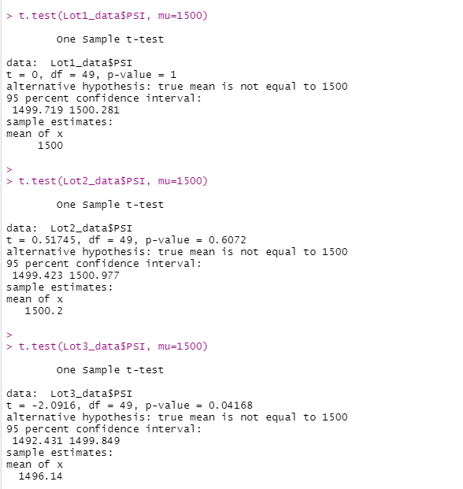

# **R and Statistics**
# **MechaCar_Statistical_Analysis** 

* A few weeks after starting his new role, Jeremy is approached by upper management about a special project. AutosRUs’ newest prototype, the MechaCar, is suffering from production troubles that are blocking the manufacturing team’s progress. AutosRUs’ upper management has called on Jeremy and the data analytics team to review the production data for insights that may help the manufacturing team.

* In this challenge, we will help Jeremy and the data analytics team do the following:

	- Perform multiple linear regression analysis to identify which variables in the dataset predict the mpg of MechaCar prototypes
	- Collect summary statistics on the pounds per square inch (PSI) of the suspension coils from the manufacturing lots
	- Run t-tests to determine if the manufacturing lots are statistically different from the mean population
	- Design a statistical study to compare vehicle performance of the MechaCar vehicles against vehicles from other manufacturers. For each statistical analysis, you’ll write a summary interpretation of the findings.

## Linear Regression to Predict MPG 

### Multiple linear regression 

* Which variables/coefficients provided a non-random amount of variance to the mpg values in the dataset?
	- The Variables that provide a non-random amount of variance to the mpg values in the dataset are vehicle_length, ground_clearance and Intercept. From the p-values values, we can see that vehicle_length, ground_clearance and Intercept have significant impace on mgp. The vehicle_weight, spoiler_angle and AWD provide no significant impact on mpg.

* Is the slope of the linear model considered to be zero? Why or why not?
	- The slope of the linear model is not considered to be zero. The p-value of our linear regression analysis is 5.35e-11, which is much smaller than our significance level of 0.05%.we can state that there is sufficient evidence to reject our null hypothesis, which means that the slope of our linear model is not zero.
 
* Does this linear model predict mpg of MechaCar prototypes effectively? Why or why not?
	- Yes, this linear model predicts mpg of the MechaCar prototypes effectively. The R-square of the multiple linear regression is 0.71, which means that roughly 71% of the time the variability of our dependent variable (mgp) can be predicted correctly by the model. The intercept is statistically significant, which may mean that there are other variables that can help explain the variability of our dependent variable that have not been included in our model.

## Summary Statistics on Suspension Coils
 
### total summary dataframe 

### lot summary dataframe 

* The design specifications for the MechaCar suspension coils dictate that the variance of the suspension coils must not exceed 100 pounds per square inch. Does the current manufacturing data meet this design specification for all manufacturing lots in total and each lot individually? Why or why not?

- From the total summary image, we can see that the current variance for all manufacturing lots is 62.29 PSI which means that it does meet or is below the specified 100 PSI. 
- From lot summary image, we can see that for Lots 1 and lots 2, the current variance is "0.97" PSI and "7.46" PSI respectively and the data meets the design specification.
- For lot 3, the current variance is 170.26 PSI which exceeds the 100 PSI variance by 70, So the current manufacturing data does not meet the design specification. So according to this Anaysis, the manufacturing team should use Lot 1 and Lot2.

## T-Tests on Suspension Coils 
### t test for all manufacturing lots 

* From the image we see that the p value is 1 and mean is 1500. our p-value is above our significance level of 0.05 percent, our Therefore, we do not have sufficient evidence to reject the null hypothesis, and we can conclude that the two means are statistically similar.
 
### three t-tests that compare each manufacturing lot 

* From the image we can see that the p value for lot1 is 1 and mean is 1500. our p-value is above our significance level of 0.05 percent. Therefore, we do not have sufficient evidence to reject the null hypothesis, and we can conclude that the two means are not statistically different.
* From the image we can see that the p value for lot2 is 0.61 and mean is 1500. our p-value is above our significance level of 0.05 percent. Therefore, we do not have sufficient evidence to reject the null hypothesis, and we can conclude that the two means are statistically similar.
* From the image we can see that the p value for lot3 is 0.042 and mean is 1496. Our p-value is lower than our significance level of 0.05 percent. Therefore, we have sufficient evidence to reject the null hypothesis, and we can conclude that the two means are statistically different and the PSI for manufacturing lot3 is statistically different from the population mean of 1,500 pounds per square inch. There is some data in lot3 that suggest problem with production and should review Lot3 to determine what the problem is.

## Study Design: MechaCar vs Competition
* In this section we will include a short description of a statistical study that can quantify how the MechaCar performs against the competition
* we will address the folowing questions
* What metric or metrics are you going to test?
	- The following metrics will be of interest to a consumer
	- Sales: Dependent variable
	- city or highway fuel efficiency : Independent Variable
	- Cost to the consumer: Independent Variable
	- Safety rating: Independent Variable
	- maintenance cost: Independent Variable 
* What is the null hypothesis or alternative hypothesis? 
	- The Null hypothesis is if the independent variables (city or highway fuel efficiency and Safety rating) have no significant impact on Sales. The alternative hypothesis is to predict if each independent variables (city or highway fuel efficiency and Safety rating) have significant impact on the dependent variable (Sales) of the cars. 

* What statistical test would you use to test the hypothesis? And why?
	- I would use Multiple linear regression to test the Hypothesis. Using the p value, I would be able to predict if each independent variables (city or highway fuel efficiency and Safety rating) have significant impact on the Sales of the cars. It means that the slope of our linear model is not zero.

* What data is needed to run the statistical test? 
	- I would use data sets that include the metrics that are collected from different competitors of different car types for about three years from population.

* In conclusion, using the results (the squared and P value) from test I would be able to reject or accept the Null Hypothesis. As well from statistical analysis I would be able to conclude of how the MechaCar performs against the competition. 
